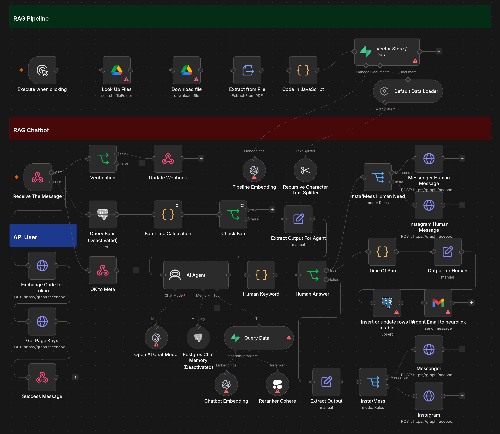

# Omni-Channel RAG Engine

Production-ready automation architecture and Retrieval-Augmented Generation (RAG) backend engineered to handle asynchronous webhooks, context-aware vector retrieval, and state-managed agent transitions.

## Technical Architecture Deep-Dive

### 1. Ingestion Layer & Verification
* **Webhook Architecture:** Direct ingestion endpoint configured to parse stateless incoming payloads from Meta Graph APIs (Instagram and Messenger).
* **Security Validation:** Implements automated verification routines to safely authenticate connection signatures before processing down-pipeline nodes.

### 2. Stateful Session Isolation & Anti-Spam Logic
* **The Ban Mechanism:** Employs a defensive execution branch designed to protect system resources and api token budgets during manual escalations.
* **Database Tracking:** When active support is flagged, structural JavaScript transforms track the precise session timestamp and commit user metadata directly to a relational database table. The session is temporarily isolated, suppressing automated model inferences for a two-hour window to maintain clean single-agent communication boundaries.

### 3. Structural Storage & Vector Retrieval
* **Vector Embeddings Store:** Utilizes a target relational engine running remote vector processing plugins to execute semantic similarity matches on ingested documentation pools.
* **Context Preservation:** Coordinates dynamic data injection workflows via persistent data tables to track historical parameters across individual multi-turn conversation frames.

### 4. Dynamic Human-in-the-Loop Failover
* **Confidence Constraints:** Fallback tracking modules continuously scan model outputs for systemic exceptions, processing deadlocks, or explicit user requests for escalation.
* **Notification Dispatch:** Triggers instant communication relays across communication endpoints to notify developers with complete state data for accelerated remediation.

## Core Core Engineering Components
* **Orchestration Core:** n8n Workflow Automation
* **Data Layer & Storage Strategy:** Supabase, PostgreSQL 
* **Semantic Processing Model Suite:** OpenAI Models, Cohere Reranking Packages
* **API Structural Matrix:** Meta Graph API Core, Gmail Services Matrix
